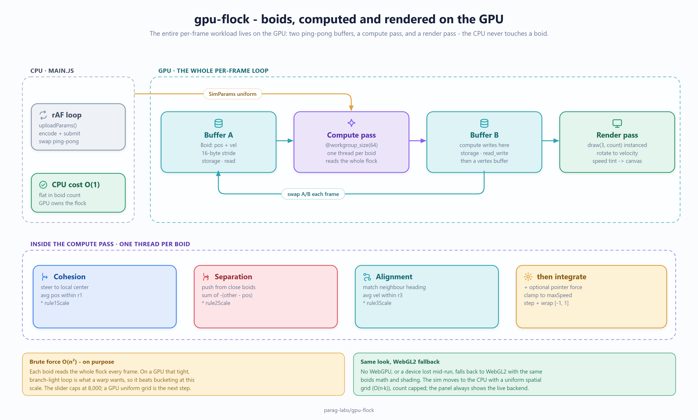

# Design notes

gpu-flock is a boids flocking simulation whose entire per-frame workload — the
neighbour search, the steering, the integration, and the draw — runs on the GPU.
This document explains the decisions behind that, the trade-offs I made on purpose,
and the things it deliberately does **not** try to be.

*The whole system on one page. Source: [docs/diagrams/architecture.svg](docs/diagrams/architecture.svg).*

## The one idea

Keep the particles on the GPU for their whole lifetime and never copy them back.
Everything else follows from that. Positions and velocities live in GPU storage
buffers; the compute pass reads and writes them; the render pass draws straight from
the same memory. The CPU's only job per frame is to upload a small uniform block
(the rule weights, Δt, the pointer) and issue two pass encoders. There is no
per-particle work on the CPU on the WebGPU path.

## Decisions and trade-offs

### Brute-force O(n²) neighbour search on the GPU — on purpose

Each boid reads the *entire* flock every frame to accumulate the three Reynolds
rules. That's O(n²) work. On a CPU that's the thing you must avoid; on a GPU it's
often the right first answer, because:

- The inner loop is perfectly coherent and branch-light — exactly what a warp/
  wavefront wants. Thousands of threads each do the same tight loop with no
  divergence.
- A spatial acceleration structure (uniform grid, BVH) means building and sorting
  buckets on the GPU every frame, plus scattered memory access — more code, more
  passes, and worse memory coherence at the scales this demo targets.

So the trade is **simplicity and coherence now, quadratic scaling later**. It holds
thousands of boids at interactive frame rates on a modern discrete or integrated GPU;
it is not meant to hold hundreds of thousands. If you needed that, the honest next
step is a GPU uniform-grid bucketing pass in front of the neighbour loop — see
Non-goals.

### Ping-pong (double) buffering

A boid must never read a half-updated flock, or the simulation shears. Two particle
buffers are swapped every frame: compute reads buffer A and writes buffer B, the
render pass draws B, and next frame the roles swap. This is why there are two
allocations of the particle data rather than one in-place buffer. It costs a second
buffer's worth of memory to buy a consistent read snapshot — a cheap, standard trade.

### One buffer, two bind points

The particle buffer is created with `STORAGE | VERTEX | COPY_DST` so the *same*
allocation is bound as a storage buffer for the compute pass and as a per-instance
vertex buffer for the draw. That's what removes the copy-back: simulation output is
render input, with no CPU staging buffer in between.

### The CPU cost is O(1) in the particle count

The uniform block is 11 floats + 1 uint regardless of how many boids are simulated.
Changing the boid count reallocates the storage buffers but doesn't add per-frame CPU
work, so the CPU side stays flat as the flock grows.

### WebGL2 fallback: the same look, a different *where*

WebGPU is not everywhere yet, and a GPU device can be lost mid-run. Rather than show
a dead page, gpu-flock falls back to a WebGL2 renderer whose boids math matches
`boids.compute.wgsl` and whose GLSL shading matches `boids.render.wgsl`, so the
simulation and colours are identical. The one real difference is *where* the sim runs:
the fallback moves it to the CPU. Because a CPU can't afford the O(n²) walk, the
fallback uses a **uniform spatial grid** so neighbour search is O(n·k), and it caps
the boid count to keep the frame smooth. The panel always shows which backend is live,
and `?webgl2` forces the fallback for comparison.

This asymmetry — brute force on the GPU, spatial grid on the CPU — is itself the
clearest illustration of the design point: the right data structure depends on the
hardware you're running on.

## Performance, honestly

- Frame rate is **GPU-dependent**. "Thousands of boids at 60 fps" is what a modern
  GPU delivers; an old integrated GPU or the WebGL2 fallback will do fewer. There is
  no committed benchmark harness here because the number is a property of the viewer's
  hardware and browser, not of a script — this is a demo, not a benchmarked library.
- Cost scales as **O(n²)** in the boid count on the WebGPU path (see above). The UI
  caps the slider at 8,000 so the quadratic term stays comfortable on typical hardware.
- The WGSL shaders are validated in CI with [`naga`](https://github.com/gfx-rs/wgpu/tree/trunk/naga)
  (`.github/workflows/validate.yml`), so a shader that wouldn't compile can't land.

## Non-goals

- **Not a general particle/physics engine.** It does boids, in 2D, in clip space.
- **No spatial acceleration on the GPU path.** The quadratic neighbour walk is a
  deliberate simplification; a GPU uniform-grid pass is the documented next step, not
  something this repo pretends to already have.
- **No 3D, no obstacles, no predators, no trails.** These are all natural extensions;
  leaving them out keeps the shaders readable as a teaching example.
- **No determinism or reproducibility guarantees.** Floating-point flocking is
  chaotic and the initial flock is randomly seeded; two runs will not match.
- **No persistence, no networking, no multiplayer.** It's a single-page, single-tab,
  in-memory visualisation.
- **Not a benchmark.** Frame rate depends on hardware; there is deliberately no
  `BENCHMARKS.md` claiming a portable number.

The point of gpu-flock is to be a compact, readable illustration of the GPGPU pattern
— compute-per-element, no CPU round-trip, ping-pong buffers, instanced rendering — not
to be the last word in flocking performance.
