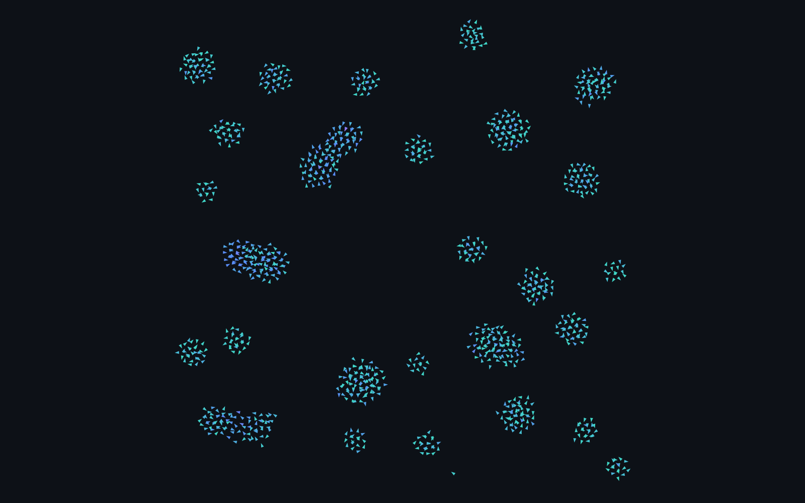

# gpu-flock

**Thousands of boids, computed *and* rendered entirely on the GPU — with WebGPU compute shaders.**

[**▶ Live demo**](https://parag-labs.github.io/gpu-flock/) · zero dependencies · WebGPU with an automatic WebGL2 fallback

gpu-flock is a real-time [boids](https://en.wikipedia.org/wiki/Boids) flocking simulation where the
*entire* per-frame workload lives on the GPU. Each frame, one compute-shader invocation per boid reads
the whole flock, applies the three classic Reynolds steering rules, integrates its motion, and hands the
result straight to a render pass — the CPU never touches a single particle. On a modern GPU it flocks
thousands of agents at 60 fps.



---

## Why it's interesting

Most browser boids demos run the O(n²) neighbour search on the CPU in JavaScript and top out around a few
hundred agents. gpu-flock instead expresses the whole simulation as a **GPU compute shader**, so it scales
to thousands of boids by using the same hardware parallelism that powers modern rendering:

- **Compute-per-boid.** `@workgroup_size(64)` — one thread per boid, thousands in flight at once.
- **No CPU round-trip.** Positions/velocities live in GPU storage buffers for their whole lifetime. The
  same buffer is bound as a `storage` buffer for compute *and* as a `vertex` buffer for the draw call, so
  simulation output is rendered with **no copy back to the CPU**.
- **Ping-pong buffers.** Two particle buffers are swapped every frame so a boid never reads a
  half-updated flock — the compute pass reads buffer A and writes buffer B; the render pass draws B; next
  frame they swap.
- **Instanced rendering.** A single 3-vertex triangle is instanced once per boid, oriented to its
  velocity in the vertex shader and tinted by speed in the fragment shader.

It's a compact, readable illustration of the modern GPGPU pattern — the kind of data-parallel design that
shows up in physics, particle systems, ML kernels, and simulation.

## Controls

| Control | Effect |
| --- | --- |
| **Boids** | Number of agents simulated on the GPU (200 – 8,000). |
| **Speed** | Global time-scale for the whole flock. |
| **Cohesion** | How strongly boids steer toward their local flock's center. |
| **Separation** | How strongly boids push away from close neighbours. |
| **Alignment** | How strongly boids match their neighbours' heading. |
| **Left-drag** | Attract the flock toward the pointer. |
| **Right-drag** | Scatter the flock away from the pointer. |
| **Pause / Reset** | Freeze the simulation / re-seed a fresh random flock. |

## How it works

```
                per frame
   ┌────────────────────────────────────────────────┐
   │  uniforms (rules, Δt, pointer, count) ──┐       │
   │                                         ▼       │
   │  buffer[t] ──►  COMPUTE  ──► buffer[t^1]        │   compute pass
   │  (read)      (Reynolds rules,   (write)         │   1 thread / boid
   │               integrate, wrap)                  │
   │                     │                           │
   │                     ▼                           │
   │  buffer[t^1] ──►  RENDER (instanced triangles)  │   render pass
   │                     │                           │
   │                     ▼                           │
   │              swap t ^= 1                        │
   └────────────────────────────────────────────────┘
```

**1. Compute pass — [`src/boids.compute.wgsl`](src/boids.compute.wgsl)**
Each invocation walks the whole flock and accumulates the three Reynolds rules within their radii:

- **Cohesion** — steer toward the average position of nearby boids.
- **Separation** — steer away from boids that are too close.
- **Alignment** — match the average velocity of nearby boids.

It then adds the optional pointer force, clamps to `maxSpeed`, integrates in clip space, wraps at the
edges, and writes the new state to the output buffer.

**2. Render pass — [`src/boids.render.wgsl`](src/boids.render.wgsl)**
The output buffer is bound as a per-instance vertex buffer. The vertex shader rotates a small triangle to
point along each boid's velocity; the fragment shader ramps its color by speed (teal → blue → magenta).

**3. Driver — [`src/main.js`](src/main.js)**
Requests the adapter/device, allocates the ping-pong storage buffers and the uniform block, builds the
compute and render pipelines, wires the UI + pointer, and runs the `requestAnimationFrame` loop:
`upload params → compute → render → swap → repeat`. If WebGPU is unavailable it shows a graceful
fallback instead of a blank page.

### Data layout

- **Boid** = `pos: vec2<f32>` + `vel: vec2<f32>` → 16-byte stride, shared by compute (storage) and render (vertex).
- **SimParams** uniform = 11 × `f32` (Δt, three rule radii, three rule scales, maxSpeed, pointer x/y/force)
  + 1 × `u32` (active count).
- Particle buffers use `STORAGE | VERTEX | COPY_DST` so one allocation serves both passes.

## Running locally

WebGPU requires the page to be served over `http://localhost` or `https://` (not `file://`). Any static
server works:

```bash
git clone https://github.com/parag-labs/gpu-flock
cd gpu-flock

# pick one:
python -m http.server 8811
npx serve .

# then open http://localhost:8811
```

There is **no build step and no dependencies** — it's plain ES modules, HTML, and WGSL.

## Runs everywhere — WebGL2 fallback

WebGPU is the headline, but you shouldn't hit a dead end on an older browser or a locked-down
machine. If WebGPU is unavailable — or the GPU device is lost mid-run — gpu-flock automatically falls
back to an **equivalent WebGL2 renderer** so it keeps animating:

- **Same flock, same look.** The fallback's boids math matches `boids.compute.wgsl` line-for-line, and
  its GLSL shading matches `boids.render.wgsl`, so the simulation and colors are identical.
- **Only *where* it runs differs.** The simulation moves to the CPU — with a **uniform spatial grid** so
  neighbour search stays O(n·k) instead of O(n²) — and WebGL2 draws the same instanced triangles. The
  boid count is capped in fallback mode to keep the CPU sim smooth.
- **Honest UI.** The panel shows which backend is live (`WebGPU` or `WebGL2`).

Append **`?webgl2`** to the URL to force the fallback path (handy for comparison or debugging):
[parag-labs.github.io/gpu-flock/?webgl2](https://parag-labs.github.io/gpu-flock/?webgl2).

## Browser support

Runs on essentially any modern browser — WebGPU where available, WebGL2 everywhere else:

- **WebGPU (primary):** Chrome / Edge 113+, Safari 18+ (macOS Sequoia / iOS 18), Firefox behind
  `dom.webgpu.enabled` / Nightly — on a machine with GPU access.
- **WebGL2 (fallback):** every current desktop and mobile browser.

You can check WebGPU support at [webgpureport.org](https://webgpureport.org). The only time gpu-flock
shows a static explainer instead of the canvas is the rare case where *both* WebGPU and WebGL2 are
unavailable.

## Project structure

```
gpu-flock/
├── index.html                 UI, styling, and the last-resort fallback card
├── src/
│   ├── main.js                backend orchestrator + WebGPU driver: device, buffers, pipelines, loop, UI
│   ├── boids.compute.wgsl     WebGPU flocking update (one thread per boid)
│   ├── boids.render.wgsl      WebGPU instanced, velocity-oriented, speed-tinted triangles
│   └── webgl-fallback.js      WebGL2 fallback: CPU sim (spatial grid) + instanced render, same look
└── .github/workflows/pages.yml   deploys the demo to GitHub Pages
```

The WGSL shaders are validated in CI-friendly isolation with
[`naga`](https://github.com/gfx-rs/wgpu/tree/trunk/naga) (the same shader translator wgpu uses).

## License

[MIT](LICENSE) © 2026 Parag Sawant
